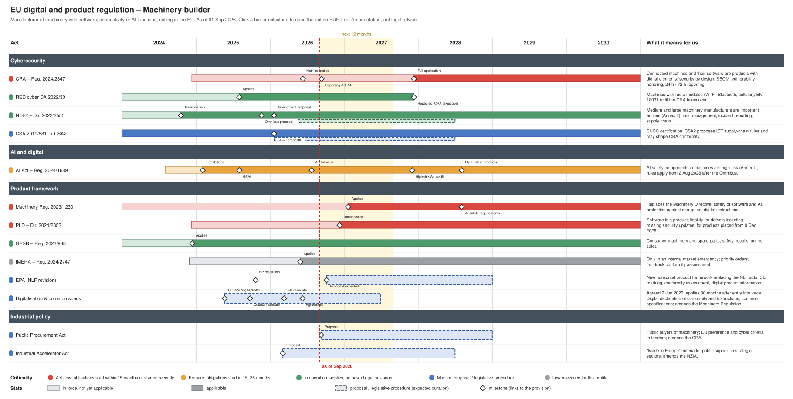

<!-- as_of: 2026-09-01 -->
# EU regulation timeline

When do EU rules on cybersecurity, AI and products start to apply, and what do they
mean for a company? A timeline of the acts, their application dates and a
criticality rating per company profile.

**Interactive page:** <https://git-z0man.github.io/eu-regulation-timeline/>

As of **01 September 2026**. Dates are taken from the legal texts (links open EUR-Lex).
Criticality is computed from the dates and is an orientation for planning, not legal
advice. This repository is generated automatically; please do not open pull requests
against the files.

## Machinery builder

Manufacturer of machinery with software, connectivity or AI functions, selling in the EU.

Editable in draw.io: [`machinery-builder.drawio`](machinery-builder.drawio) · Image: [`machinery-builder.png`](machinery-builder.png) · Print (A3): [`machinery-builder.pdf`](machinery-builder.pdf)

| | Act | Criticality | Why | Next milestone | What it means |
| --- | --- | --- | --- | --- | --- |
| 🔴 | [CRA – Reg. 2024/2847](http://data.europa.eu/eli/reg/2024/2847/oj) | act | obligations start 11 Sep 2026 | 11 Sep 2026 Reporting Art. 14 | Connected machines and their software are products with digital elements; security by design, SBOM, vulnerability handling, 24 h / 72 h reporting. |
| 🔴 | [Machinery Reg. 2023/1230](http://data.europa.eu/eli/reg/2023/1230/oj) | act | obligations start 20 Jan 2027 | 20 Jan 2027 Applies | Replaces the Machinery Directive; safety of software and AI, protection against corruption, digital instructions. |
| 🔴 | [PLD – Dir. 2024/2853](http://data.europa.eu/eli/dir/2024/2853/oj) | act | obligations start 09 Dec 2026 | 09 Dec 2026 Transposition | Software is a product; liability for defects including missing security updates, for products placed from 9 Dec 2026. |
| 🟠 | [AI Act – Reg. 2024/1689](http://data.europa.eu/eli/reg/2024/1689/oj) | prepare | obligations start 02 Aug 2028 | 02 Dec 2027 High-risk Annex III | AI safety components in machines are high-risk (Annex I); rules apply from 2 Aug 2028 after the Omnibus. |
| 🟢 | [GPSR – Reg. 2023/988](http://data.europa.eu/eli/reg/2023/988/oj) | operate | applies | – | Consumer machinery and spare parts; safety, recalls, online sales. |
| 🟢 | [NIS-2 – Dir. 2022/2555](http://data.europa.eu/eli/dir/2022/2555/oj) | operate | applies | – | Medium and large machinery manufacturers are important entities (Annex II); risk management, incident reporting, supply chain. |
| 🟢 | [RED cyber DA 2022/30](http://data.europa.eu/eli/reg_del/2022/30/oj) | operate | applies | 11 Dec 2027 Repealed, CRA takes over | Machines with radio modules (Wi-Fi, Bluetooth, cellular); EN 18031 until the CRA takes over. |
| 🔵 | [CSA 2019/881 → CSA2](http://data.europa.eu/eli/reg/2019/881/oj) | monitor | certification under the CSA is voluntary; CSA2 may shape CRA conformity assessment | – | EUCC certification; CSA2 proposes ICT supply-chain rules and may shape CRA conformity. |
| 🔵 | [Digitalisation & common specs](https://eur-lex.europa.eu/legal-content/EN/TXT/?uri=CELEX:52025PC0504) | monitor | proposal or legislative procedure | – | Digital declaration of conformity and instructions; common specifications where standards are missing (amends the Machinery Regulation). |
| 🔵 | [EPA (NLF revision)](https://eur-lex.europa.eu/legal-content/EN/TXT/?uri=CELEX:52025IP0242) | monitor | proposal or legislative procedure | 06 Oct 2026 Proposal expected | New horizontal product framework replacing the NLF acts; CE marking, conformity assessment, digital product information. |
| 🔵 | [Industrial Accelerator Act](https://eur-lex.europa.eu/legal-content/EN/TXT/?uri=CELEX:52026PC0100) | monitor | proposal or legislative procedure | – | "Made in Europe" criteria for public support in strategic sectors; amends the NZIA. |
| 🔵 | [Public Procurement Act](https://eur-lex.europa.eu/legal-content/EN/TXT/?uri=CELEX:52026PC0590) | monitor | proposal or legislative procedure | 09 Sep 2026 Proposal | Public buyers of machinery; EU preference and cyber criteria in tenders; amends the CRA. |
| ⚪ | [IMERA – Reg. 2024/2747](http://data.europa.eu/eli/reg/2024/2747/oj) | low | low relevance for this profile | – | Only in an internal market emergency; priority orders, fast-track conformity assessment. |
